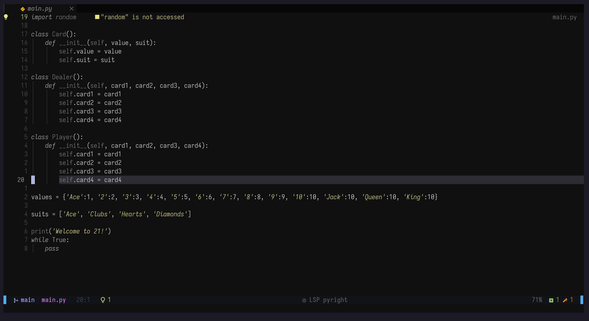
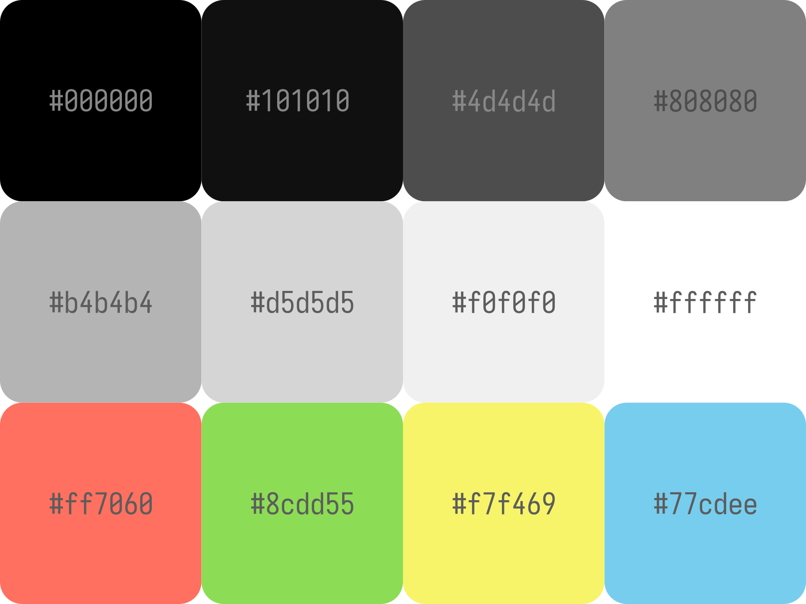

# basalt.nvim
A dark colorscheme for Neovim written using [lush.nvim](https://github.com/rktjmp/lush.nvim)'s colorscheme templete.





## Installation
Using lazy.nvim
```lua
{
    'unayakani/basalt.nvim',
    dependencies = { 'rktjmp/lush.nvim' },
    lazy = false,
    config = function ()
        vim.cmd('colorscheme basalt')
    end,
}
```
